# Casos de prueba — Rewards Program API

Proyecto: **Rewards Program API** · Rama: `feature/api_rest_rewards`
Ejecutado por: **David Esneider Herrera Isaza**

> Reglas de negocio bajo prueba:
> - **Ganar puntos:** 1 punto por cada `$1.000` comprados.
> - **Carry-over:** el remanente de una compra que no completa `$1.000` no se pierde, se acumula para la siguiente compra.
> - **Redimir puntos:** 1 punto = `$100`, hasta el saldo disponible (`ganados - redimidos`).
> - **Saldo insuficiente:** intentar redimir más puntos de los disponibles se rechaza con `409 Conflict`.
> - No existe endpoint de registro de clientes: la cuenta de puntos se crea automáticamente con la primera compra.

---

## Índice de casos

| ID | Módulo | Nombre | Resultado esperado |
|----|--------|--------|--------------------|
| TEST001 | Compras | Asignar un punto por cada 1000 pesos comprados | `201` |
| TEST002 | Compras | Compra múltiplo exacto de 1000 otorga puntos proporcionales | `201` |
| TEST003 | Compras | Compra menor a 1000 no otorga puntos | `201` |
| TEST004 | Compras | Compra con decimales que no completa otro múltiplo | `201` |
| TEST005 | Compras | Regla de carry-over entre dos compras | `201` |
| TEST006 | Compras | Secuencia de compras pequeñas cruzando varios múltiplos | `201` |
| TEST007 | Compras | Compra con monto negativo | `400` |
| TEST008 | Compras | Compra con monto cero | `400` |
| TEST009 | Compras | Compra con customerId vacío | `400` |
| TEST010 | Compras | Compra sin el campo amount | `400` |
| TEST011 | Compras | Compra con cuerpo JSON malformado | `400` |
| TEST012 | Compras | Cliente nuevo se crea automáticamente en la primera compra | `201` |
| TEST013 | Saldo | Consultar saldo de cliente sin compras | `200` |
| TEST014 | Saldo | Saldo refleja puntos ganados menos redimidos | `200` |
| TEST015 | Saldo | Consultar saldo con customerId en blanco | `400` |
| TEST016 | Redenciones | Redención parcial exitosa devuelve valor en pesos y saldo restante | `201` |
| TEST017 | Redenciones | Redención del total disponible deja el saldo en cero | `201` |
| TEST018 | Redenciones | Redención con saldo insuficiente | `409` |
| TEST019 | Redenciones | Redención de cliente sin compras previas | `409` |
| TEST020 | Redenciones | Segunda redención que acumulada supera el saldo | `409` |
| TEST021 | Redenciones | Redención con puntos en cero | `400` |
| TEST022 | Redenciones | Redención con puntos negativos | `400` |
| TEST023 | Redenciones | Redención con customerId vacío | `400` |
| TEST024 | Redenciones | Redención con puntos no enteros | `400` |
| TEST025 | Redenciones | Redención sin el campo points | `400` |
| TEST026 | Flujo E2E | Flujo completo compra → consulta → redención → saldo | `201` / `200` / `409` |

> **Nota sobre identificadores:** los campos `purchaseId` y `redemptionId` son enteros autoincrementales generados por la base de datos H2 en memoria; su valor concreto depende del estado de la base al momento de ejecutar y puede variar entre corridas.

---

## Módulo: Compras — `POST /api/purchases`

---

**IDENTIFICADO:** TEST001

**NOMBRE:** validar asignacion de puntos

**REQUERIMIENTO:** el sistema debe asignar un punto por cada 1000 pesos comprados

**PRECONDICIONES:** No hay condiciones previas

**DATOS DE PRUEBA:**
```json
{
  "customerId": "cust-demo-001",
  "amount": 1000
}
```

**PASOS DE LA PRUEBA:**
* Realizar request al endpoint de compra `/api/purchases` con los datos correctos usando método `POST`

**RESULTADO ESPERADO:**
* Status code `201`
* Payload de respuesta:
```json
{
  "customerId": "cust-demo-001",
  "purchaseId": 2,
  "amount": 1000,
  "pointsEarned": 1,
  "totalAvailablePoints": 1
}
```

**ESTADO:** Correcto

**EVIDENCIAS:**
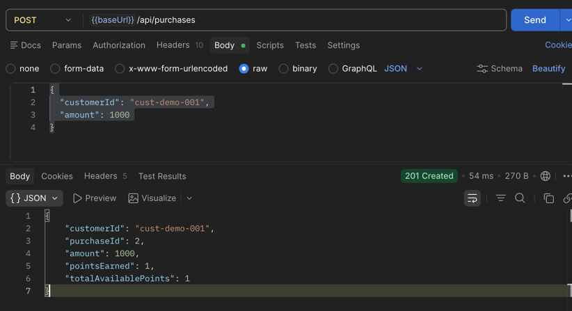

**EJECUTADO POR:** David Esneider Herrera Isaza

---

**IDENTIFICADO:** TEST002

**NOMBRE:** compra multiplo exacto de 1000 otorga puntos proporcionales

**REQUERIMIENTO:** el sistema debe asignar un punto por cada 1000 pesos comprados

**PRECONDICIONES:** El cliente no ha realizado compras previas

**DATOS DE PRUEBA:**
```json
{
  "customerId": "cust-test-002",
  "amount": 3000
}
```

**PASOS DE LA PRUEBA:**
* Realizar request al endpoint `/api/purchases` con método `POST` y el body indicado

**RESULTADO ESPERADO:**
* Status code `201`
* Payload de respuesta:
```json
{
  "customerId": "cust-test-002",
  "purchaseId": "<generado por el sistema>",
  "amount": 3000,
  "pointsEarned": 3,
  "totalAvailablePoints": 3
}
```

**ESTADO:** DONE

**EVIDENCIAS:**

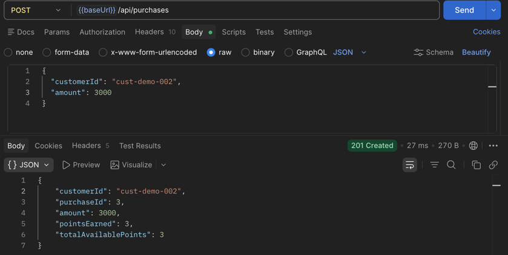

**EJECUTADO POR:** David Esneider Herrera Isaza

---

**IDENTIFICADO:** TEST003

**NOMBRE:** compra menor a 1000 no otorga puntos

**REQUERIMIENTO:** el sistema debe asignar un punto por cada 1000 pesos comprados; una compra que no alcanza los 1000 pesos otorga 0 puntos

**PRECONDICIONES:** El cliente no ha realizado compras previas

**DATOS DE PRUEBA:**
```json
{
  "customerId": "cust-test-003",
  "amount": 700
}
```

**PASOS DE LA PRUEBA:**
* Realizar request al endpoint `/api/purchases` con método `POST` y el body indicado

**RESULTADO ESPERADO:**
* Status code `201`
* Payload de respuesta:
```json
{
  "customerId": "cust-test-003",
  "purchaseId": "<generado por el sistema>",
  "amount": 700,
  "pointsEarned": 0,
  "totalAvailablePoints": 0
}
```

**ESTADO:** DONE

**EVIDENCIAS:** 

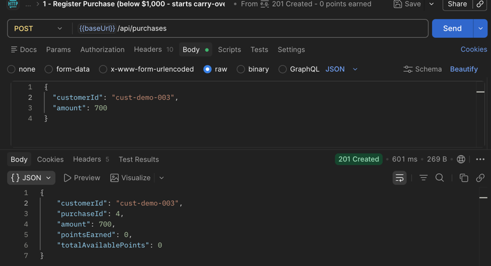

**EJECUTADO POR:** David Esneider Herrera Isaza

---

**IDENTIFICADO:** TEST004

**NOMBRE:** compra con decimales que no completa otro multiplo otorga solo el punto entero

**REQUERIMIENTO:** el conteo de puntos usa múltiplos enteros de 1000; los pesos que no completan otro múltiplo no otorgan un punto adicional

**PRECONDICIONES:** El cliente no ha realizado compras previas

**DATOS DE PRUEBA:**
```json
{
  "customerId": "cust-test-004",
  "amount": 1999.99
}
```

**PASOS DE LA PRUEBA:**
* Realizar request al endpoint `/api/purchases` con método `POST` y el body indicado

**RESULTADO ESPERADO:**
* Status code `201`
* Payload de respuesta:
```json
{
  "customerId": "cust-test-004",
  "purchaseId": "<generado por el sistema>",
  "amount": 1999.99,
  "pointsEarned": 1,
  "totalAvailablePoints": 1
}
```

**ESTADO:** DONE

**EVIDENCIAS:**

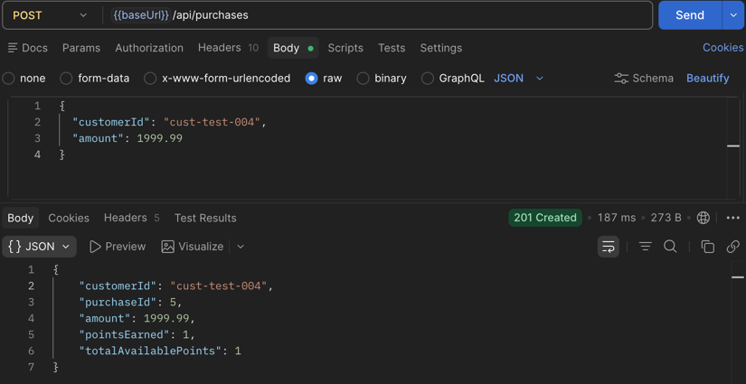

**EJECUTADO POR:** David Esneider Herrera Isaza

---

**IDENTIFICADO:** TEST005

**NOMBRE:** regla de carry-over entre dos compras acumula el remanente hasta completar el punto

**REQUERIMIENTO:** el remanente de una compra que no completa 1000 pesos no se pierde, se acumula y se cuenta en la siguiente compra

**PRECONDICIONES:** El cliente no ha realizado compras previas

**DATOS DE PRUEBA:**
```json
// Compra 1
{ "customerId": "cust-test-005", "amount": 700 }

// Compra 2
{ "customerId": "cust-test-005", "amount": 500 }
```

**PASOS DE LA PRUEBA:**
* Realizar request `POST /api/purchases` con la Compra 1 (monto 700)
* Realizar request `POST /api/purchases` con la Compra 2 (monto 500)

**RESULTADO ESPERADO:**
* Compra 1 → Status code `201`, `pointsEarned = 0`, `totalAvailablePoints = 0`
* Compra 2 → Status code `201`:
```json
{
  "customerId": "cust-test-005",
  "purchaseId": "<generado por el sistema>",
  "amount": 500,
  "pointsEarned": 1,
  "totalAvailablePoints": 1
}
```
  (el total acumulado llega a 1200 pesos, por lo que se otorga 1 punto)

**ESTADO:** DONE

**EVIDENCIAS:** 

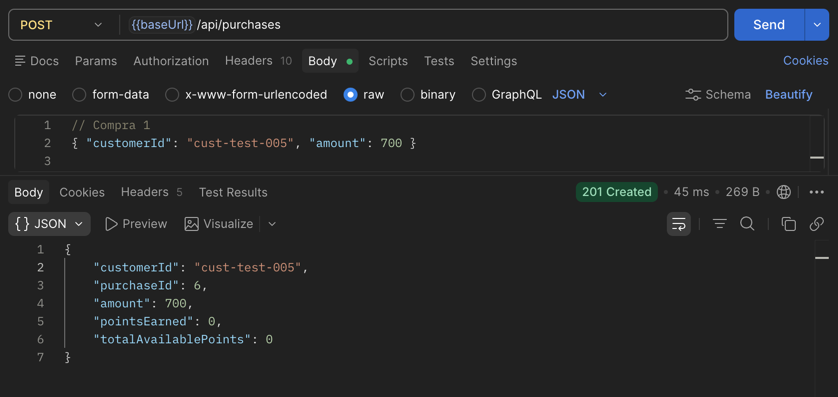

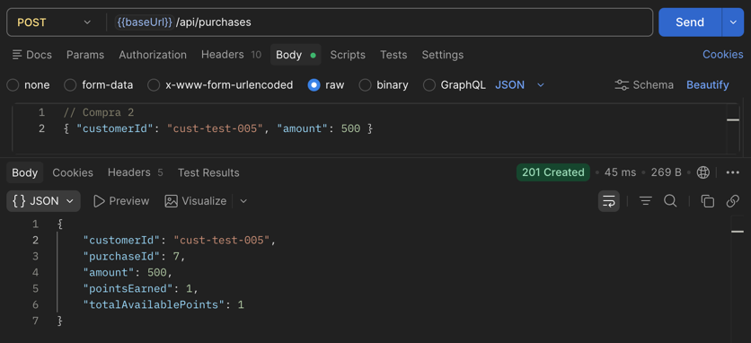

**EJECUTADO POR:** David Esneider Herrera Isaza

---

**IDENTIFICADO:** TEST006

**NOMBRE:** secuencia de compras pequenas acumula correctamente cruzando varios multiplos

**REQUERIMIENTO:** el carry-over debe acumularse a través de múltiples compras y otorgar los puntos correctos al cruzar cada múltiplo de 1000

**PRECONDICIONES:** El cliente no ha realizado compras previas

**DATOS DE PRUEBA:**
```json
// Compras consecutivas para "cust-test-006"
{ "customerId": "cust-test-006", "amount": 400 }
{ "customerId": "cust-test-006", "amount": 400 }
{ "customerId": "cust-test-006", "amount": 400 }
{ "customerId": "cust-test-006", "amount": 900 }
```

**PASOS DE LA PRUEBA:**
* Realizar las 4 requests `POST /api/purchases` en orden
* Consultar el saldo con `GET /api/customers/cust-test-006/points`

**RESULTADO ESPERADO:**
* Compra 1 (acumulado 400) → `201`, `pointsEarned = 0`
* Compra 2 (acumulado 800) → `201`, `pointsEarned = 0`
* Compra 3 (acumulado 1200) → `201`, `pointsEarned = 1`
* Compra 4 (acumulado 2100) → `201`, `pointsEarned = 1`
* Consulta de saldo → `200`, `availablePoints = 2`

**ESTADO:** DONE

**EVIDENCIAS:**

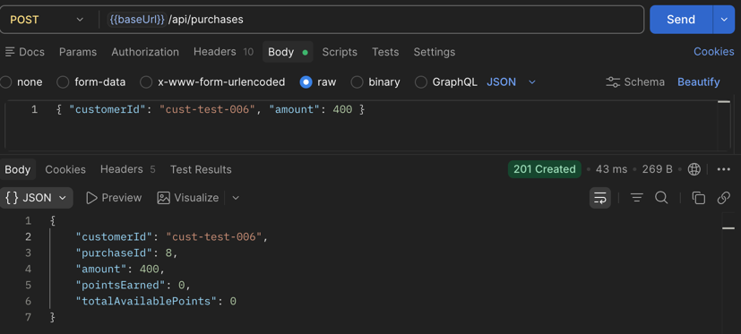

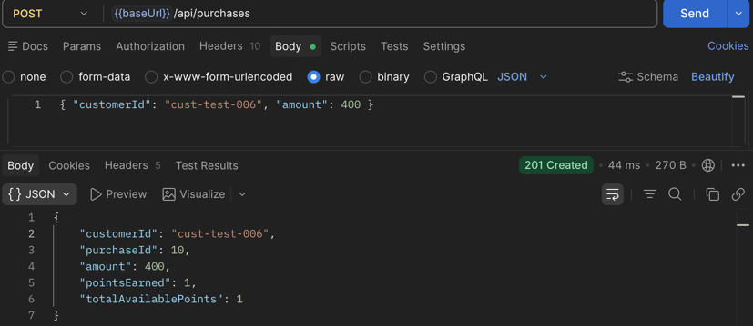
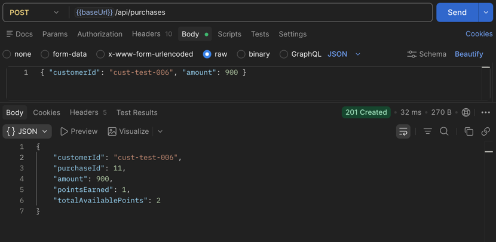

**EJECUTADO POR:** David Esneider Herrera Isaza

---

**IDENTIFICADO:** TEST007

**NOMBRE:** compra con monto negativo retorna 400 con mensaje de campo

**REQUERIMIENTO:** el campo `amount` es obligatorio y debe ser estrictamente mayor que 0

**PRECONDICIONES:** No hay condiciones previas

**DATOS DE PRUEBA:**
```json
{
  "customerId": "cust-test-007",
  "amount": -5
}
```

**PASOS DE LA PRUEBA:**
* Realizar request `POST /api/purchases` con el body indicado

**RESULTADO ESPERADO:**
* Status code `400`
* Payload de error:
```json
{
  "status": 400,
  "error": "Bad Request",
  "message": "La solicitud contiene datos inválidos.",
  "errors": [
    { "field": "amount", "message": "amount debe ser mayor que 0" }
  ],
  "timestamp": "<instante ISO-8601>",
  "path": "/api/purchases"
}
```

**ESTADO:** DONE

**EVIDENCIAS:**

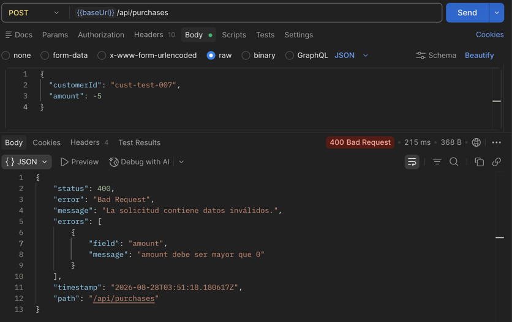

**EJECUTADO POR:** David Esneider Herrera Isaza

---

**IDENTIFICADO:** TEST008

**NOMBRE:** compra con monto cero retorna 400

**REQUERIMIENTO:** el campo `amount` debe ser estrictamente mayor que 0 (cero no es válido)

**PRECONDICIONES:** No hay condiciones previas

**DATOS DE PRUEBA:**
```json
{
  "customerId": "cust-test-008",
  "amount": 0
}
```

**PASOS DE LA PRUEBA:**
* Realizar request `POST /api/purchases` con el body indicado

**RESULTADO ESPERADO:**
* Status code `400`
* El arreglo `errors` contiene un elemento con `field = "amount"` y `message = "amount debe ser mayor que 0"`

**ESTADO:** DONE

**EVIDENCIAS:**


**EJECUTADO POR:** David Esneider Herrera Isaza

---

**IDENTIFICADO:** TEST009

**NOMBRE:** compra con customerId vacio retorna 400

**REQUERIMIENTO:** el campo `customerId` es obligatorio y no puede estar en blanco

**PRECONDICIONES:** No hay condiciones previas

**DATOS DE PRUEBA:**
```json
{
  "customerId": "",
  "amount": 1000
}
```

**PASOS DE LA PRUEBA:**
* Realizar request `POST /api/purchases` con el body indicado

**RESULTADO ESPERADO:**
* Status code `400`
* El arreglo `errors` contiene un elemento con `field = "customerId"` y `message = "customerId no puede estar vacío"`

**ESTADO:** Pendiente de ejecución

**EVIDENCIAS:** _Pendiente de ejecución._

**EJECUTADO POR:** David Esneider Herrera Isaza

---

**IDENTIFICADO:** TEST010

**NOMBRE:** compra sin el campo amount retorna 400

**REQUERIMIENTO:** el campo `amount` es obligatorio

**PRECONDICIONES:** No hay condiciones previas

**DATOS DE PRUEBA:**
```json
{
  "customerId": "cust-test-010"
}
```

**PASOS DE LA PRUEBA:**
* Realizar request `POST /api/purchases` con el body indicado (sin el campo `amount`)

**RESULTADO ESPERADO:**
* Status code `400`
* El arreglo `errors` contiene un elemento con `field = "amount"` y `message = "amount es obligatorio"`

**ESTADO:** DONE

**EVIDENCIAS:**

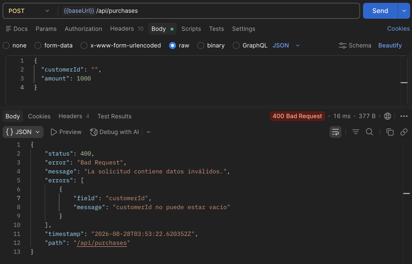

**EJECUTADO POR:** David Esneider Herrera Isaza

---

**IDENTIFICADO:** TEST011

**NOMBRE:** compra con cuerpo JSON malformado retorna 400

**REQUERIMIENTO:** una solicitud con el cuerpo JSON inválido o incompleto debe rechazarse con `400 Bad Request`

**PRECONDICIONES:** No hay condiciones previas

**DATOS DE PRUEBA:**
```text
{ "customerId": "cust-test-011", "amount":
```

**PASOS DE LA PRUEBA:**
* Realizar request `POST /api/purchases` con `Content-Type: application/json` y el cuerpo malformado indicado

**RESULTADO ESPERADO:**
* Status code `400`
* Payload de error:
```json
{
  "status": 400,
  "error": "Bad Request",
  "message": "El cuerpo de la solicitud es inválido o está malformado.",
  "errors": [],
  "timestamp": "<instante ISO-8601>",
  "path": "/api/purchases"
}
```

**ESTADO:** DONE

**EVIDENCIAS:**

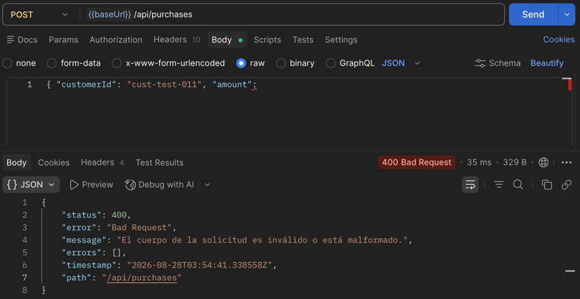

**EJECUTADO POR:** David Esneider Herrera Isaza

---

**IDENTIFICADO:** TEST012

**NOMBRE:** cliente nuevo se crea automaticamente en la primera compra

**REQUERIMIENTO:** no existe endpoint de registro de clientes; la cuenta de puntos se crea automáticamente la primera vez que se usa un `customerId` en una compra

**PRECONDICIONES:** El `customerId` utilizado nunca ha sido usado antes en el sistema

**DATOS DE PRUEBA:**
```json
{
  "customerId": "cust-nuevo-012",
  "amount": 1000
}
```

**PASOS DE LA PRUEBA:**
* Realizar request `POST /api/purchases` con un `customerId` inédito
* Consultar el saldo con `GET /api/customers/cust-nuevo-012/points`

**RESULTADO ESPERADO:**
* La compra retorna Status code `201` con `pointsEarned = 1` y `totalAvailablePoints = 1`
* La consulta de saldo retorna `200` con `totalPointsEarned = 1`, `totalPointsRedeemed = 0`, `availablePoints = 1`

**ESTADO:** DONDE

**EVIDENCIAS:**

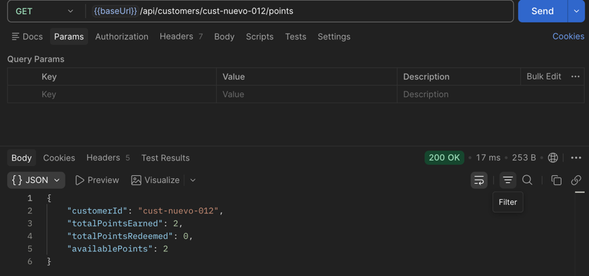

**EJECUTADO POR:** David Esneider Herrera Isaza

---

## Módulo: Consulta de saldo — `GET /api/customers/{customerId}/points`

---

**IDENTIFICADO:** TEST013

**NOMBRE:** consultar saldo de cliente sin compras retorna 200 con cero

**REQUERIMIENTO:** si el cliente nunca ha realizado una compra, la consulta de saldo retorna `200 OK` con todos los valores en 0 (nunca retorna `404`)

**PRECONDICIONES:** El cliente no ha realizado compras ni redenciones

**DATOS DE PRUEBA:**
```text
customerId de ruta: cust-test-013
```

**PASOS DE LA PRUEBA:**
* Realizar request `GET /api/customers/cust-test-013/points`

**RESULTADO ESPERADO:**
* Status code `200`
* Payload de respuesta:
```json
{
  "customerId": "cust-test-013",
  "totalPointsEarned": 0,
  "totalPointsRedeemed": 0,
  "availablePoints": 0
}
```

**ESTADO:** DONE

**EVIDENCIAS:**

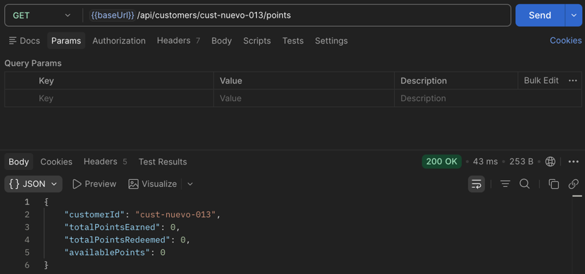

**EJECUTADO POR:** David Esneider Herrera Isaza

---

**IDENTIFICADO:** TEST014

**NOMBRE:** saldo refleja puntos ganados menos redimidos tras compras y redencion

**REQUERIMIENTO:** el saldo disponible es igual a los puntos ganados menos los puntos ya redimidos

**PRECONDICIONES:** El cliente no ha realizado compras previas

**DATOS DE PRUEBA:**
```json
// 1. Compra
{ "customerId": "cust-test-014", "amount": 4000 }

// 2. Redención
{ "customerId": "cust-test-014", "points": 1 }
```

**PASOS DE LA PRUEBA:**
* Realizar request `POST /api/purchases` con monto 4000
* Realizar request `POST /api/redemptions` con 1 punto
* Realizar request `GET /api/customers/cust-test-014/points`

**RESULTADO ESPERADO:**
* Status code `200`
* Payload de respuesta:
```json
{
  "customerId": "cust-test-014",
  "totalPointsEarned": 4,
  "totalPointsRedeemed": 1,
  "availablePoints": 3
}
```

**ESTADO:** DONE

**EVIDENCIAS:**

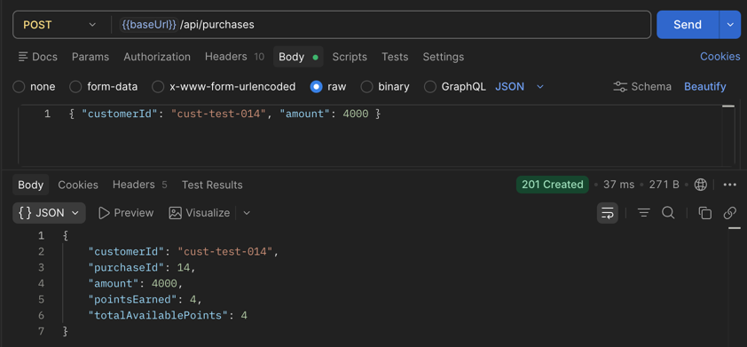
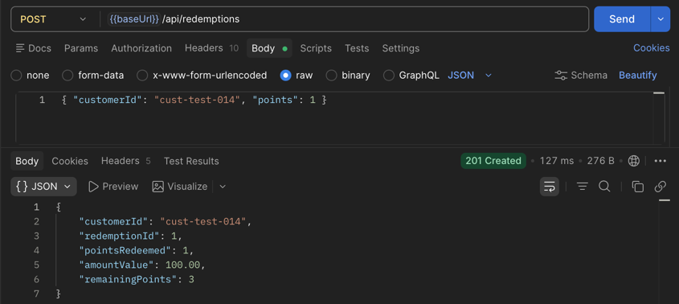
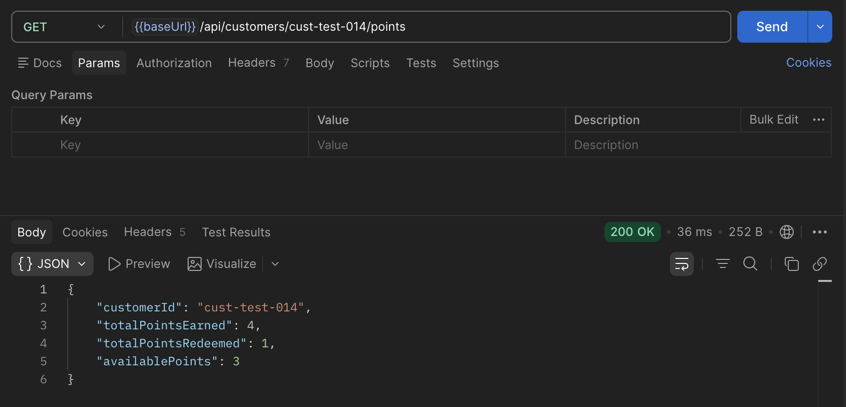


**EJECUTADO POR:** David Esneider Herrera Isaza

---

**IDENTIFICADO:** TEST015

**NOMBRE:** consultar saldo con customerId en blanco retorna 400

**REQUERIMIENTO:** el `customerId` de la ruta no puede estar en blanco

**PRECONDICIONES:** No hay condiciones previas

**DATOS DE PRUEBA:**
```text
customerId de ruta: " " (un espacio en blanco, URL-encoded como %20)
Request: GET /api/customers/%20/points
```

**PASOS DE LA PRUEBA:**
* Realizar request `GET /api/customers/%20/points`

**RESULTADO ESPERADO:**
* Status code `400`
* El arreglo `errors` contiene un elemento cuyo `field` referencia a `customerId` con `message = "customerId no puede estar vacío"`

**ESTADO:** DONE

**EVIDENCIAS:**

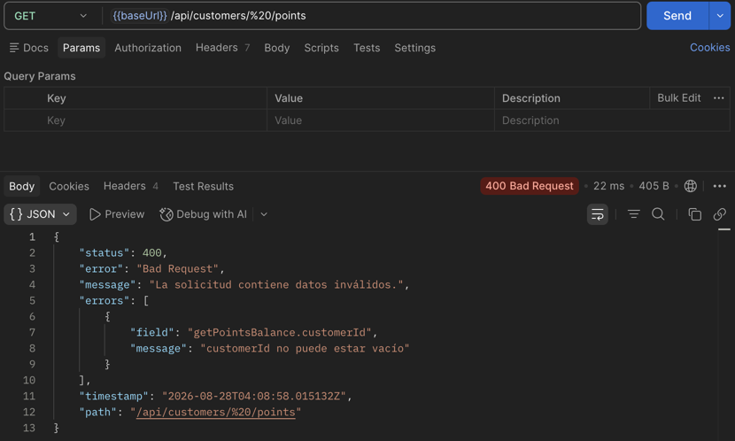

**EJECUTADO POR:** David Esneider Herrera Isaza

---

## Módulo: Redenciones — `POST /api/redemptions`

---

**IDENTIFICADO:** TEST016

**NOMBRE:** redencion parcial exitosa devuelve valor en pesos y saldo restante

**REQUERIMIENTO:** al redimir puntos el sistema descuenta el saldo y devuelve su valor monetario (1 punto = 100 pesos)

**PRECONDICIONES:** El cliente tiene 5 puntos disponibles (compra previa de 5000 pesos)

**DATOS DE PRUEBA:**
```json
// Precondición
{ "customerId": "cust-test-016", "amount": 5000 }

// Redención bajo prueba
{ "customerId": "cust-test-016", "points": 2 }
```

**PASOS DE LA PRUEBA:**
* Realizar request `POST /api/purchases` con monto 5000
* Realizar request `POST /api/redemptions` con 2 puntos
* Consultar el saldo con `GET /api/customers/cust-test-016/points`

**RESULTADO ESPERADO:**
* Status code `201`
* Payload de respuesta:
```json
{
  "customerId": "cust-test-016",
  "redemptionId": "<generado por el sistema>",
  "pointsRedeemed": 2,
  "amountValue": 200.00,
  "remainingPoints": 3
}
```
* La consulta de saldo retorna `200` con `availablePoints = 3`

**ESTADO:** Pendiente de ejecución

**EVIDENCIAS:**

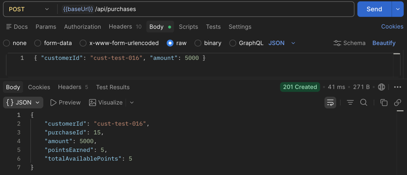
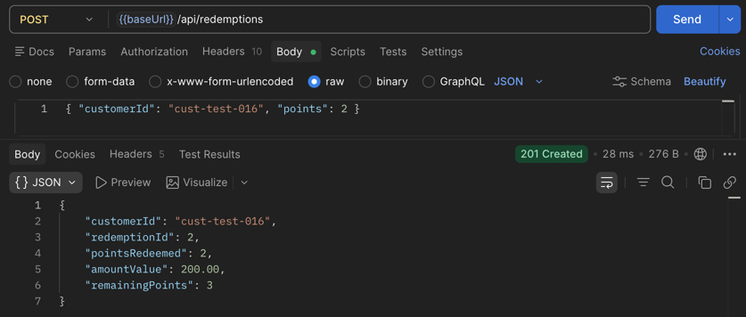

**EJECUTADO POR:** David Esneider Herrera Isaza

---

**IDENTIFICADO:** TEST017

**NOMBRE:** redencion del total disponible deja el saldo en cero

**REQUERIMIENTO:** un cliente puede redimir cualquier cantidad de puntos hasta su saldo disponible

**PRECONDICIONES:** El cliente tiene 2 puntos disponibles (compra previa de 2000 pesos)

**DATOS DE PRUEBA:**
```json
// Precondición
{ "customerId": "cust-test-017", "amount": 2000 }

// Redención bajo prueba
{ "customerId": "cust-test-017", "points": 2 }
```

**PASOS DE LA PRUEBA:**
* Realizar request `POST /api/purchases` con monto 2000
* Realizar request `POST /api/redemptions` con 2 puntos

**RESULTADO ESPERADO:**
* Status code `201`
* Payload de respuesta:
```json
{
  "customerId": "cust-test-017",
  "redemptionId": "<generado por el sistema>",
  "pointsRedeemed": 2,
  "amountValue": 200.00,
  "remainingPoints": 0
}
```

**ESTADO:** DONE

**EVIDENCIAS:**

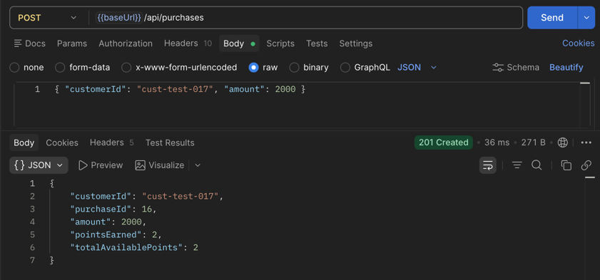
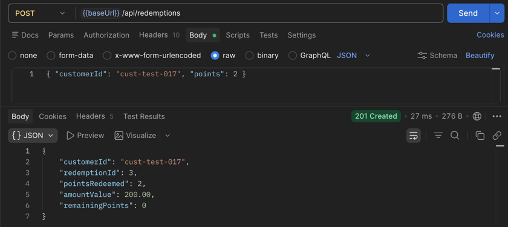

**EJECUTADO POR:** David Esneider Herrera Isaza

---

**IDENTIFICADO:** TEST018

**NOMBRE:** redencion con saldo insuficiente retorna 409 con mensaje claro

**REQUERIMIENTO:** intentar redimir más puntos de los disponibles se rechaza con `409 Conflict` y un mensaje claro

**PRECONDICIONES:** El cliente tiene 1 punto disponible (compra previa de 1000 pesos)

**DATOS DE PRUEBA:**
```json
// Precondición
{ "customerId": "cust-test-018", "amount": 1000 }

// Redención bajo prueba
{ "customerId": "cust-test-018", "points": 5 }
```

**PASOS DE LA PRUEBA:**
* Realizar request `POST /api/purchases` con monto 1000
* Realizar request `POST /api/redemptions` con 5 puntos

**RESULTADO ESPERADO:**
* Status code `409`
* Payload de error:
```json
{
  "status": 409,
  "error": "Conflict",
  "message": "El cliente cust-test-018 solicitó redimir 5 puntos pero solo tiene 1 disponibles.",
  "errors": [],
  "timestamp": "<instante ISO-8601>",
  "path": "/api/redemptions"
}
```

**ESTADO:** DONDE

**EVIDENCIAS:**

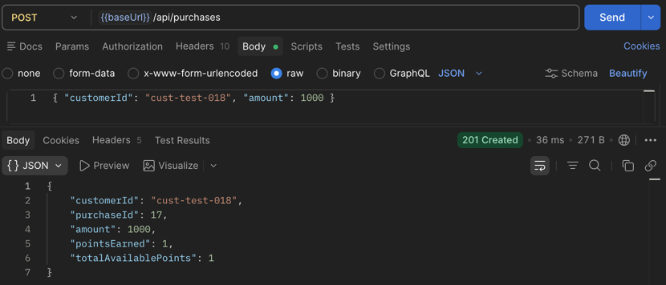
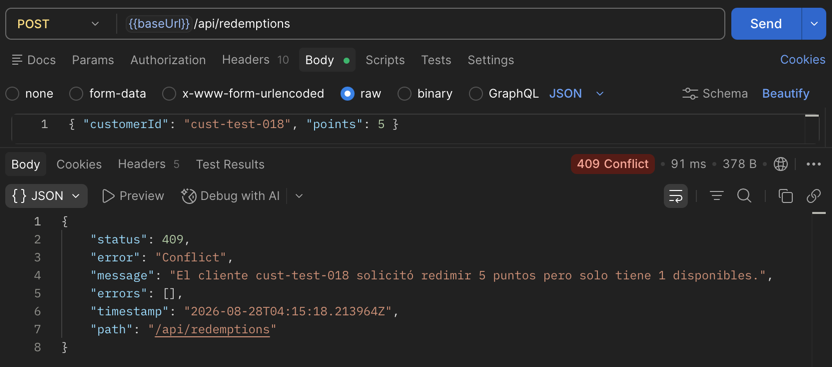

**EJECUTADO POR:** David Esneider Herrera Isaza

---

**IDENTIFICADO:** TEST019

**NOMBRE:** redencion de cliente sin compras previas retorna 409

**REQUERIMIENTO:** un cliente que nunca ha comprado tiene saldo 0, por lo que cualquier redención se rechaza con `409 Conflict`

**PRECONDICIONES:** El `customerId` nunca ha sido usado en el sistema

**DATOS DE PRUEBA:**
```json
{
  "customerId": "cust-test-019",
  "points": 1
}
```

**PASOS DE LA PRUEBA:**
* Realizar request `POST /api/redemptions` con el body indicado

**RESULTADO ESPERADO:**
* Status code `409`
* `message = "El cliente cust-test-019 solicitó redimir 1 puntos pero solo tiene 0 disponibles."`

**ESTADO:**DONE

**EVIDENCIAS:**

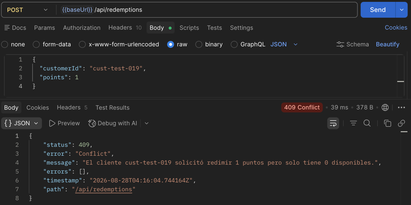

**EJECUTADO POR:** David Esneider Herrera Isaza

---

**IDENTIFICADO:** TEST020

**NOMBRE:** doble redencion que en conjunto supera el saldo falla en la segunda

**REQUERIMIENTO:** el saldo disponible se descuenta con cada redención; una segunda redención que exceda el saldo restante se rechaza con `409 Conflict`

**PRECONDICIONES:** El cliente tiene 3 puntos disponibles (compra previa de 3000 pesos)

**DATOS DE PRUEBA:**
```json
// Precondición
{ "customerId": "cust-test-020", "amount": 3000 }

// Redención 1
{ "customerId": "cust-test-020", "points": 2 }

// Redención 2
{ "customerId": "cust-test-020", "points": 2 }
```

**PASOS DE LA PRUEBA:**
* Realizar request `POST /api/purchases` con monto 3000
* Realizar request `POST /api/redemptions` con 2 puntos (Redención 1)
* Realizar request `POST /api/redemptions` con 2 puntos (Redención 2)

**RESULTADO ESPERADO:**
* Redención 1 → Status code `201`, `remainingPoints = 1`
* Redención 2 → Status code `409` (solo queda 1 punto disponible)

**ESTADO:** DONE

**EVIDENCIAS:**

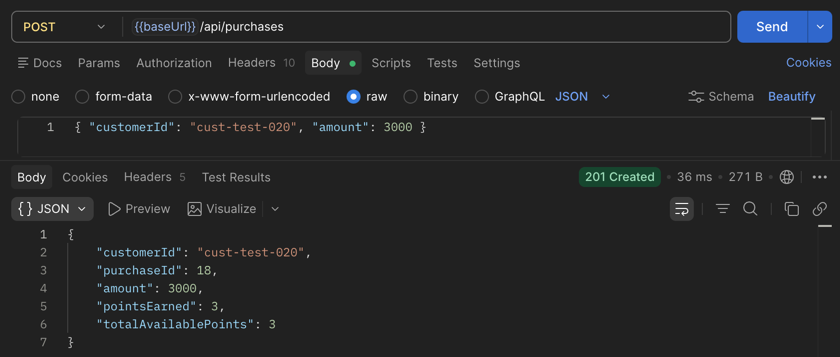
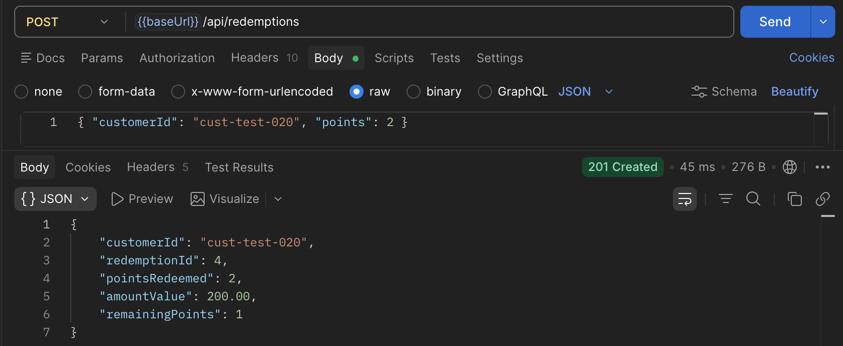
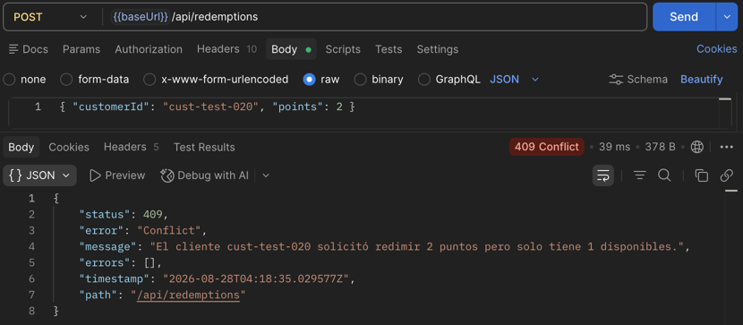


**EJECUTADO POR:** David Esneider Herrera Isaza

---

**IDENTIFICADO:** TEST021

**NOMBRE:** redencion con puntos en cero retorna 400

**REQUERIMIENTO:** el campo `points` debe ser estrictamente mayor que 0

**PRECONDICIONES:** No hay condiciones previas

**DATOS DE PRUEBA:**
```json
{
  "customerId": "cust-test-021",
  "points": 0
}
```

**PASOS DE LA PRUEBA:**
* Realizar request `POST /api/redemptions` con el body indicado

**RESULTADO ESPERADO:**
* Status code `400`
* El arreglo `errors` contiene un elemento con `field = "points"` y `message = "points debe ser mayor que 0"`

**ESTADO:** DONE

**EVIDENCIAS:**


**EJECUTADO POR:** David Esneider Herrera Isaza

---

**IDENTIFICADO:** TEST022

**NOMBRE:** redencion con puntos negativos retorna 400

**REQUERIMIENTO:** el campo `points` debe ser estrictamente mayor que 0

**PRECONDICIONES:** No hay condiciones previas

**DATOS DE PRUEBA:**
```json
{
  "customerId": "cust-test-022",
  "points": -3
}
```

**PASOS DE LA PRUEBA:**
* Realizar request `POST /api/redemptions` con el body indicado

**RESULTADO ESPERADO:**
* Status code `400`
* El arreglo `errors` contiene un elemento con `field = "points"` y `message = "points debe ser mayor que 0"`

**ESTADO:** DONE

**EVIDENCIAS:**

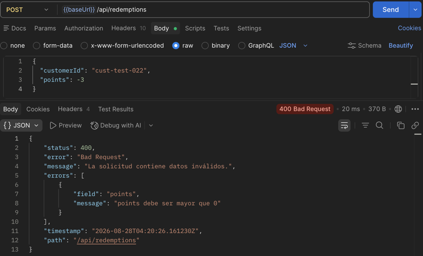

**EJECUTADO POR:** David Esneider Herrera Isaza

---

**IDENTIFICADO:** TEST023

**NOMBRE:** redencion con customerId vacio retorna 400

**REQUERIMIENTO:** el campo `customerId` es obligatorio y no puede estar en blanco

**PRECONDICIONES:** No hay condiciones previas

**DATOS DE PRUEBA:**
```json
{
  "customerId": "",
  "points": 1
}
```

**PASOS DE LA PRUEBA:**
* Realizar request `POST /api/redemptions` con el body indicado

**RESULTADO ESPERADO:**
* Status code `400`
* El arreglo `errors` contiene un elemento con `field = "customerId"` y `message = "customerId no puede estar vacío"`

**ESTADO:** DONE

**EVIDENCIAS:**

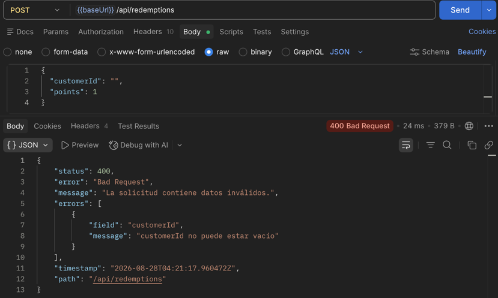

**EJECUTADO POR:** David Esneider Herrera Isaza

---

**IDENTIFICADO:** TEST024

**NOMBRE:** redencion con puntos no enteros retorna 400

**REQUERIMIENTO:** el campo `points` debe ser un número entero

**PRECONDICIONES:** No hay condiciones previas

**DATOS DE PRUEBA:**
```text
{ "customerId": "cust-test-024", "points": 2.5 }
```

**PASOS DE LA PRUEBA:**
* Realizar request `POST /api/redemptions` con `Content-Type: application/json` y el body indicado (valor decimal en `points`)

**RESULTADO ESPERADO:**
* Status code `400`
* Payload de error:
```json
{
  "status": 400,
  "error": "Bad Request",
  "message": "El cuerpo de la solicitud es inválido o está malformado.",
  "errors": [],
  "timestamp": "<instante ISO-8601>",
  "path": "/api/redemptions"
}
```

**ESTADO:** DONE

**EVIDENCIAS:**

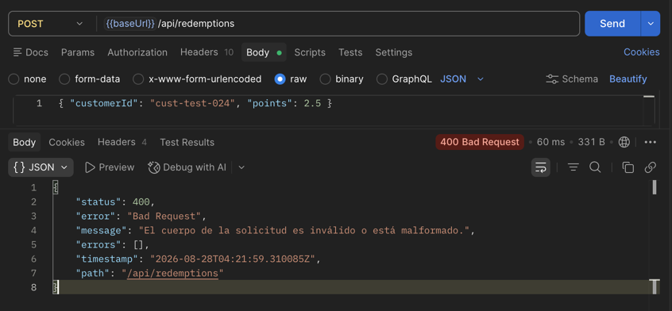

**EJECUTADO POR:** David Esneider Herrera Isaza

---

**IDENTIFICADO:** TEST025

**NOMBRE:** redencion sin el campo points retorna 400

**REQUERIMIENTO:** el campo `points` es obligatorio

**PRECONDICIONES:** No hay condiciones previas

**DATOS DE PRUEBA:**
```json
{
  "customerId": "cust-test-025"
}
```

**PASOS DE LA PRUEBA:**
* Realizar request `POST /api/redemptions` con el body indicado (sin el campo `points`)

**RESULTADO ESPERADO:**
* Status code `400`
* El arreglo `errors` contiene un elemento con `field = "points"` y `message = "points es obligatorio"`

**ESTADO:** DONE

**EVIDENCIAS:**

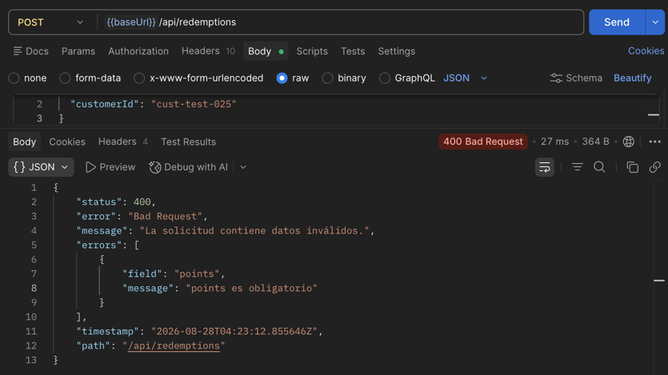

**EJECUTADO POR:** David Esneider Herrera Isaza

---

## Módulo: Flujo end-to-end

---

**IDENTIFICADO:** TEST026

**NOMBRE:** flujo completo de compras, consulta y redencion de puntos

**REQUERIMIENTO:** el sistema debe soportar el ciclo de vida completo: registrar compras, consultar saldo, redimir puntos y rechazar redenciones sin saldo

**PRECONDICIONES:** El `customerId` nunca ha sido usado en el sistema

**DATOS DE PRUEBA:**
```json
// 1. Compra
{ "customerId": "cust-test-026", "amount": 3500 }

// 2. Redención parcial
{ "customerId": "cust-test-026", "points": 2 }

// 3. Redención final
{ "customerId": "cust-test-026", "points": 1 }

// 4. Redención sin saldo
{ "customerId": "cust-test-026", "points": 1 }
```

**PASOS DE LA PRUEBA:**
* `POST /api/purchases` con monto 3500
* `GET /api/customers/cust-test-026/points`
* `POST /api/redemptions` con 2 puntos
* `GET /api/customers/cust-test-026/points`
* `POST /api/redemptions` con 1 punto
* `GET /api/customers/cust-test-026/points`
* `POST /api/redemptions` con 1 punto

**RESULTADO ESPERADO:**
* Compra → `201`
* Consulta 1 → `200`, `availablePoints = 3`
* Redención parcial → `201`, `remainingPoints = 1`
* Consulta 2 → `200`, `availablePoints = 1`
* Redención final → `201`, `remainingPoints = 0`
* Consulta 3 → `200`, `availablePoints = 0`
* Redención sin saldo → `409`

**ESTADO:** DONE

**EVIDENCIAS:**

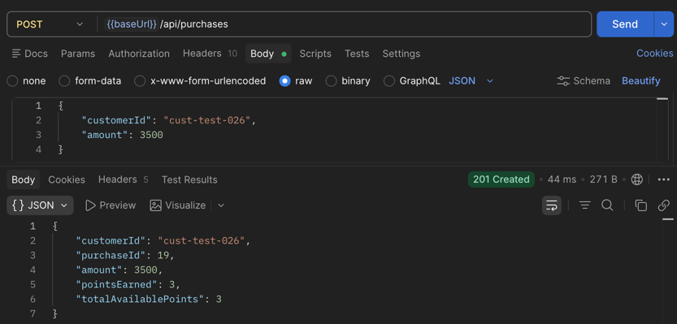
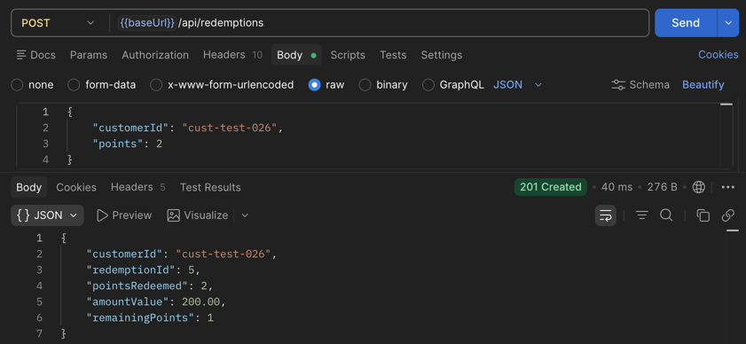
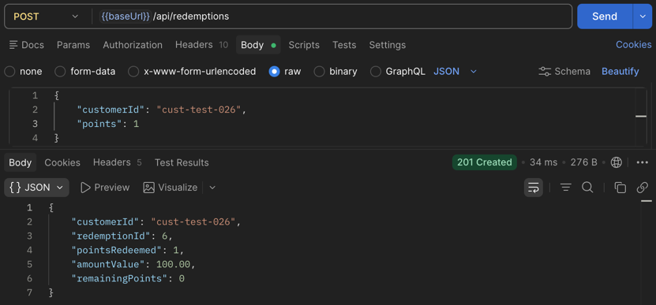
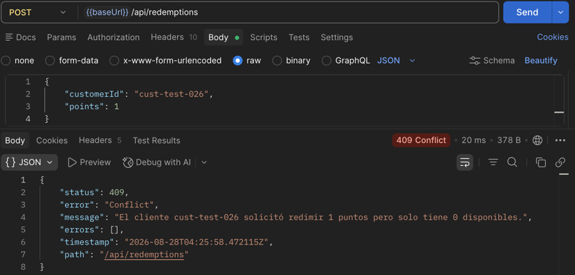

**EJECUTADO POR:** David Esneider Herrera Isaza
